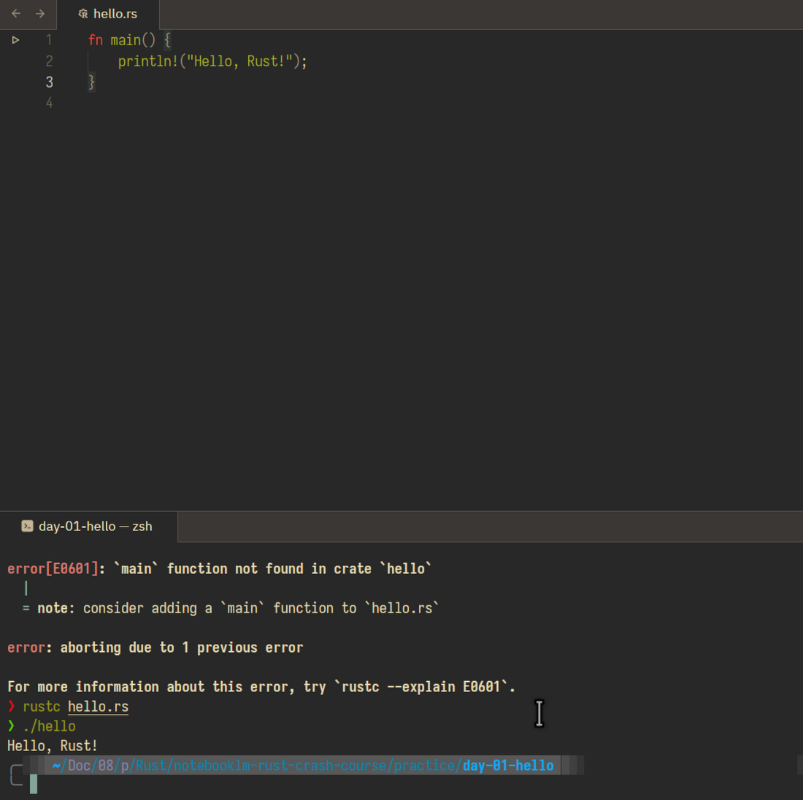
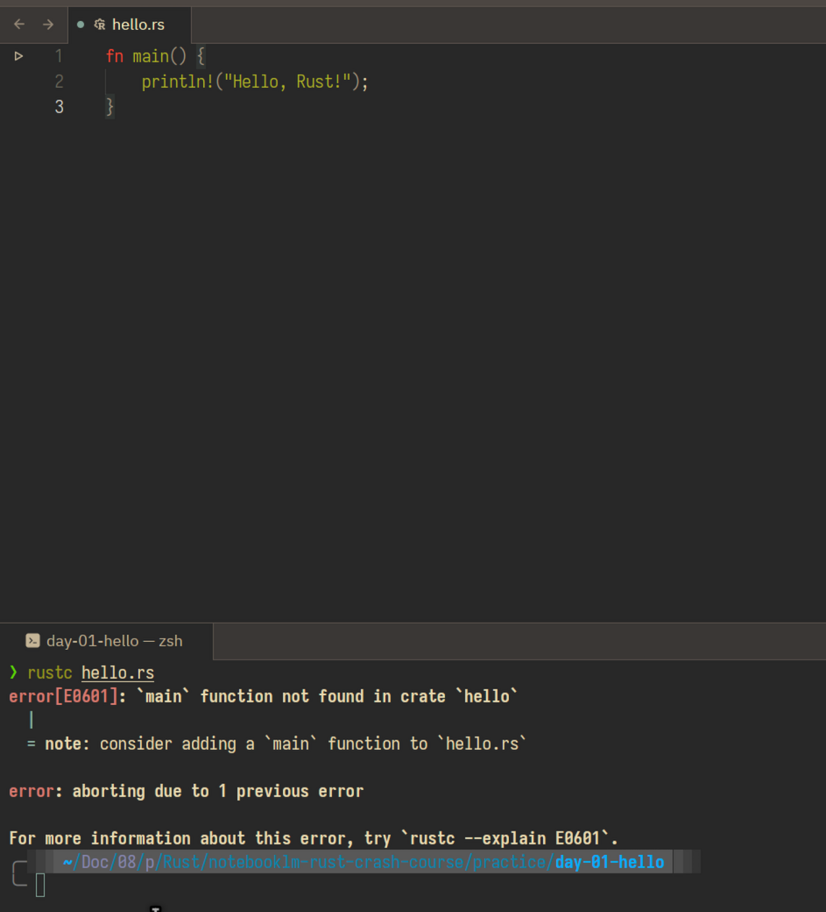
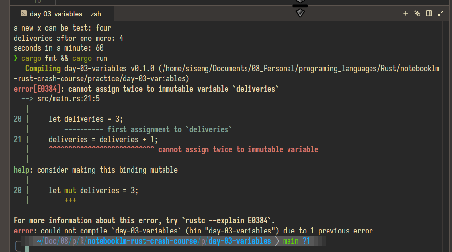

# Rust Crash Course in Zed

A practical, visual, one-lesson-per-day Rust course built around [Tech With Tim’s Rust Programming Tutorial](https://www.youtube.com/playlist?list=PLzMcBGfZo4-nyLTlSRBvo0zjSnCnqjHYQ).

The course turns the tutorial sequence into short interactive HTML lessons, with a Zed-first workflow, real code practice, retrieval checks, and a record of demonstrated learning.



## Start here

Open [Day 1 — Make a Rust program exist](lessons/0001-rust-introduction.html) in a browser. It covers:

- Opening a Rust practice folder in Zed
- Using Zed’s integrated terminal
- Creating `hello.rs` from the terminal
- Saving, compiling with `rustc`, and running the resulting binary
- The distinction between `rustc`, Cargo, `rustup`, and Python’s `uv`
- A real beginner mistake: compiling an unsaved editor buffer

## Philosophy

- **One lesson per day.** The course moves only when the learner asks for the next day.
- **Practice before progress.** Every lesson ends with a specific result to return to the teacher.
- **Zed is the default workspace.** Edit in Zed; run the exact command in Zed’s integrated terminal.
- **Local course files drive the sequence.** The exported chapter files define the order and core lesson material. External Rust documentation is optional enrichment, never a replacement curriculum.
- **Learning is demonstrated, not assumed.** `learning-records/` captures meaningful completed milestones and corrected misunderstandings.

## Source and attribution

The original course is Tech With Tim’s [Rust Programming Tutorial playlist](https://www.youtube.com/playlist?list=PLzMcBGfZo4-nyLTlSRBvo0zjSnCnqjHYQ). The local Markdown files are working course exports used to structure the daily lessons.

| Course export | Topic | Lesson status |
| --- | --- | --- |
| `03-introduction.md` | Introduction and first program | Day 1 complete |
| `04-rust-tools.md` | Cargo and Rust tools | Day 2 complete |
| `05-variables-constants-shadowing.md` | Variables, constants, shadowing | Day 3 complete |
| `06-data-types.md` | Data types | Planned |
| `07-console-input.md` | Console input | Planned |
| `08-arithmetic-type-casting.md` | Arithmetic and type casting | Planned |
| `09-control-flow.md` | Conditions and control flow | Planned |
| `10-functions-expressions-statements.md` | Functions, expressions, statements | Planned |
| `11-memory-heap-stack.md` | Memory, heap, and stack | Planned |

## Prerequisites

- [Rust via rustup](https://www.rust-lang.org/tools/install)
- [Zed](https://zed.dev/)
- A terminal shell; this workspace uses `zsh` on Linux/macOS

In Zed, use **File → Open** to open this repository, then press `Ctrl` + `` ` `` to show the integrated terminal.

Run this once now and occasionally later to update the installed Rust toolchain:

```bash
rustup update
rustc --version
cargo --version
```

If Zed cannot find `rustc` even though your normal terminal can, open the repository from the working terminal:

```bash
cd notebooklm-rust-crash-course
zed .
```

This lets Zed inherit the shell environment that already knows where Rust is installed.

## Day 1: run the first Rust program

The Day 1 practice file is already included at `practice/day-01-hello/hello.rs`.

From Zed’s integrated terminal:

```bash
cd practice/day-01-hello
rustc hello.rs
./hello
```

Expected output:

```text
Hello, Rust!
```

On Windows PowerShell, run the produced file with:

```powershell
.\hello.exe
```

### The first common error

If Rust says it cannot find `main`, but you can see `fn main()` in Zed, your editor buffer is probably unsaved. The first screenshot below shows that exact situation: the code is visible in Zed, but `rustc` still reads the older on-disk file.



Save first, then compile and run again:

```text
Ctrl+S → rustc hello.rs → ./hello
```

The second screenshot at the top of this README shows the successful rerun. The compiler reads the version of the file saved on disk, not unsaved text still held by the editor.

## `rustc`, Cargo, `rustup`, and `uv`

| Tool | Job | Closest Python/uv intuition |
| --- | --- | --- |
| `rustc` | Compiles a loose Rust source file such as `hello.rs` into a binary. | Calling a compiler directly; use it to learn the raw compile cycle. |
| Cargo | Creates, builds, runs, tests, formats, and manages dependencies for a Rust project with `Cargo.toml`. Cargo invokes `rustc` for you. | Similar to `uv` in project mode. |
| `rustup` | Installs and updates Rust toolchains and targets. | Similar to `uv python install`, not to `uv run`. |
| `target/` | Holds compiled build artifacts for a Cargo project. | **Not** a `.venv`; it is build output, not an activated package environment. |

Useful mapping:

| Python + uv | Rust |
| --- | --- |
| `uv init` | `cargo new` |
| `pyproject.toml` | `Cargo.toml` |
| `uv.lock` | `Cargo.lock` |
| `uv run …` | `cargo run` |

Use `rustc hello.rs` for Day 1 because it makes compilation visible. Use `cargo run` once you are inside a real Cargo project containing `Cargo.toml`.

## Day 3: variables, constants, and shadowing

The learner created `practice/day-03-variables` with Cargo and ran the Day 3 program successfully. The program demonstrated immutable bindings, shadowing across scopes, a mutable `deliveries` value, and the `SECONDS_PER_MINUTE` constant.

The learner also deliberately removed `mut` from `deliveries`. Zed reported error E0384 before the program ran, and `cargo run` then confirmed the same error with the exact fix: make the binding mutable.



The completed lesson is [Day 3 — Variables, constants, and shadowing](lessons/0003-variables-constants-shadowing.html). The demonstrated milestone is recorded in [learning-records/0003-variables-constants-shadowing.md](learning-records/0003-variables-constants-shadowing.md).

## Repository layout

```text
.
├── 03-introduction.md              # Day 1 course export
├── 04-rust-tools.md                # Day 2 course export
├── assets/
│   ├── course.css                  # Shared visual system for every lesson
│   ├── day-01-first-success.png    # Real Day 1 Zed result
│   └── day-03-*.png                # Real Day 3 Zed and Cargo diagnostics
├── lessons/
│   ├── 0001-rust-introduction.html # Completed interactive lesson
│   ├── 0002-cargo-and-rust-tools.html
│   └── 0003-variables-constants-shadowing.html
├── learning-records/
│   ├── 0001-first-rust-binary.md   # Demonstrated Day 1 milestone
│   ├── 0002-first-cargo-project.md
│   └── 0003-variables-constants-shadowing.md
├── practice/
│   ├── day-01-hello/hello.rs       # Runnable Day 1 source code
│   ├── day-02-cargo-greeting/      # Runnable Day 2 Cargo project
│   └── day-03-variables/           # Runnable Day 3 Cargo project
├── reference/                      # Compact reusable reference pages
├── templates/lesson.html           # Starting structure for every new lesson
├── AGENTS.md                       # Instructions for human/AI continuation
├── MISSION.md                      # Course outcome and boundaries
├── NOTES.md                        # Learner preferences and teaching rules
└── RESOURCES.md                    # Source and optional enrichment links
```

Generated binaries such as `practice/day-01-hello/hello` and Cargo’s `target/` directory are intentionally ignored by Git.

## Continue with an AI teacher

Any coding agent or LLM working in this repository should read [AGENTS.md](AGENTS.md) before creating or changing a lesson. It defines:

- What source files to read before teaching
- The one-lesson-per-day rule
- Required Zed Lab, practice, feedback, and finish-line sections
- The Tech With Tim attribution requirement
- How to reuse [templates/lesson.html](templates/lesson.html) and [assets/course.css](assets/course.css)
- When to create learning records

To build Day 4, tell the agent: “Create Day 4 from `06-data-types.md`, preserving the visual template and Zed workflow.”

## Optional enrichment

The course may link to official Rust resources when they add context, but these are explicitly optional:

- [The Rust Programming Language](https://doc.rust-lang.org/book/)
- [The Cargo Book](https://doc.rust-lang.org/cargo/)
- [Zed Rust documentation](https://zed.dev/docs/languages/rust)
- [Zed terminal documentation](https://zed.dev/docs/terminal)

## Contributing to your own learning record

This repository is a personal learning workspace. The best contribution is to complete the current lesson, preserve the code that proves it, and record only genuine milestones—not every study session.
